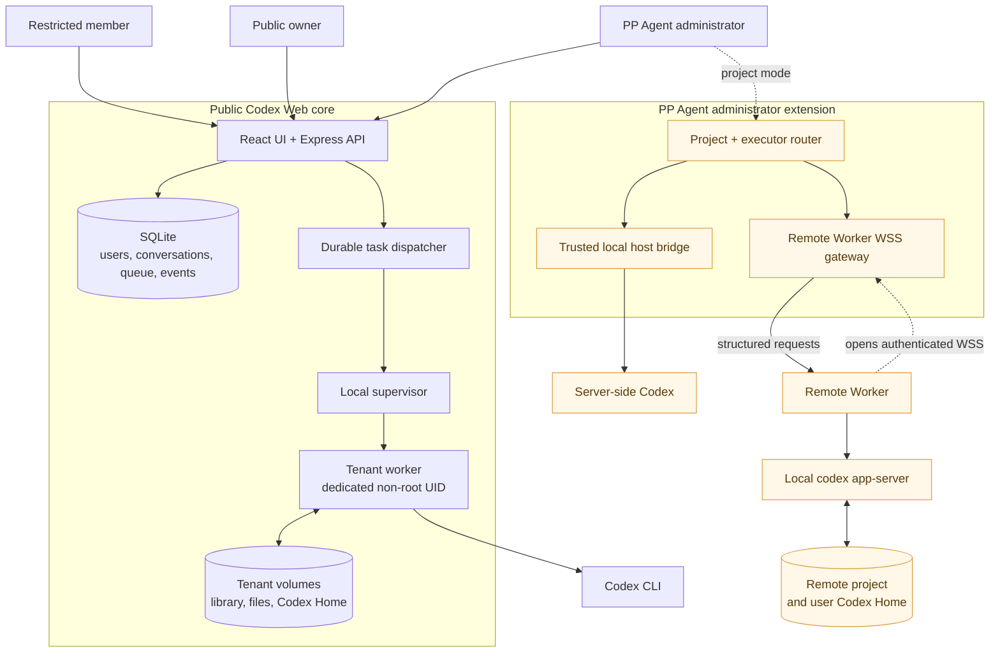
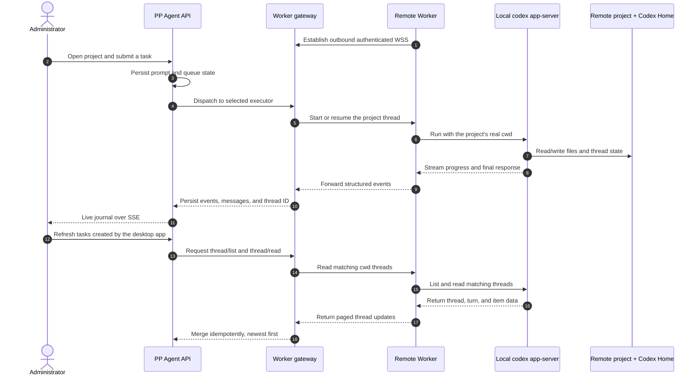
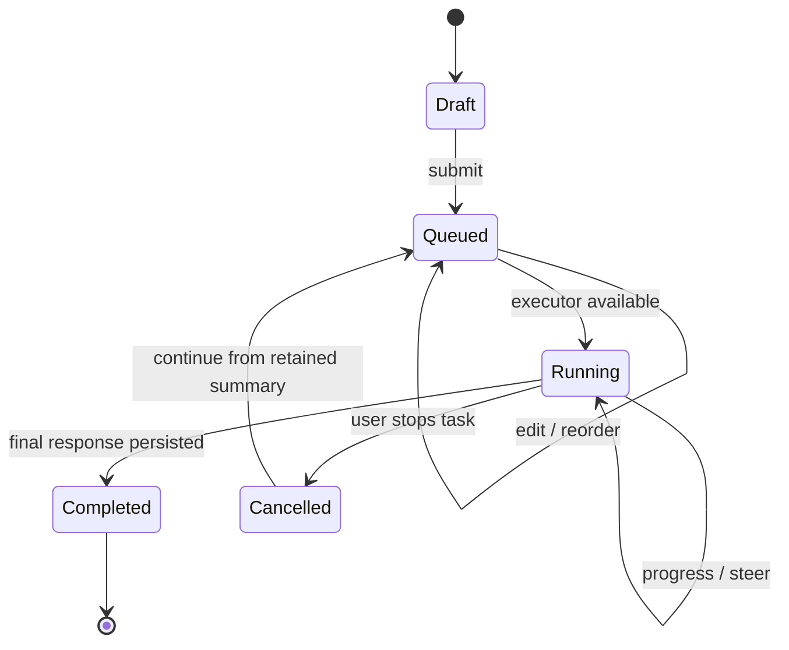

# Codex Web

An unofficial, self-hosted web workspace for the OpenAI Codex CLI. It adds persistent conversations and unsent drafts, file uploads and deliverables, server-side task queues, live steering, resumable cancellation history, automatic titles, adjustable reading size, light/dark/system appearance modes, and optional voice transcription.

> Codex Web is an independent community project. It is not affiliated with, endorsed by, or supported by OpenAI.

[中文说明](README.zh-CN.md)

## What it includes

- A responsive React chat interface for Codex CLI
- Server-persistent queued prompts with reorder, edit, delete, and steer actions
- Persistent attachments and generated deliverables
- Server-persistent unsent text, quotes, and attachments, restored across conversations, browsers, and devices
- Codex thread persistence across browser restarts
- Soft-deleted conversation audit records while workspace files are removed
- Cancellation that retains a concise history of completed work so the next turn can resume from it
- Automatic short task titles, with manual titles taking precedence
- A durable live work journal with retained stage feedback and grouped command steps
- Running work journals expand inline with the page instead of creating a nested vertical scroller
- Unread-result markers for completed conversations until their detail is viewed
- Light, dark, and system-following appearance modes
- Select message text and attach it as a removable, server-persisted reference to a new Agent question
- Load only the latest 30 messages initially, then fetch older pages at the top without moving the reader's position
- Optional Alibaba Cloud DashScope voice transcription
- A dedicated Unix identity for the Codex worker inside the container
- A managed local spreadsheet skill backed by the pinned openpyxl/pandas runtime; detailed Excel rules are injected only for matching attachments
- Optional Apps, connectors, Goals, and multi-agent features remain off unless the conversation explicitly asks for them

## How the system fits together

Codex Web is the reusable, self-hosted core of a larger personal Agent workstation design. The core turns the Codex CLI into a durable web service: the browser can disappear, but conversations, drafts, queued prompts, attachments, progress events, thread IDs, and finished files remain on the server.

The full PP Agent deployment pattern adds a second execution tier for an administrator. Restricted member accounts still run inside isolated Docker tenants, while the administrator can route project work either to a trusted server-side executor or to a Remote Worker on another computer. This repository intentionally ships only the low-privilege public core as a safe default; the administrator host bridge, project mode, Remote Worker gateway, and production provisioning are extension components, not turnkey public settings.

### Roles and execution boundaries

| Role | Execution location | Accessible state | Intended use |
| --- | --- | --- | --- |
| Restricted member | Non-root tenant worker inside Docker | Its own conversations, library, uploads, outputs, and Codex Home | A friend or team member who should not access the host or another tenant |
| Public owner | The same isolated tenant model | Its own self-hosted workspace and service settings | The default single-owner setup in this repository |
| PP Agent administrator | Explicitly selected local or remote project executor | Projects the administrator has added, plus their retained task history | Managing trusted server projects and Codex sessions on connected computers |



The important boundary is the executor, not the browser account alone. A restricted account cannot turn a web request into host access: its job is validated, handed to a fixed Unix identity, and confined to that tenant's paths. Administrator project mode is a separate, explicit trust decision and is therefore kept out of the public default deployment.

### Remote computer execution

A Remote Worker does not expose an inbound shell, RDP endpoint, or generic tunnel. It initiates an application-level WSS connection to the server, advertises its runtime capabilities, and executes only requests addressed to a registered project. Codex runs under the interactive user on that computer, with the real project directory as `cwd` and that user's normal Codex Home, so web-started and desktop-started threads share the same local Codex history.



Remote synchronization is deliberately explicit rather than pretending to be a distributed filesystem. Thread, turn, and item identifiers make imports idempotent; offline machines keep their project history visible, while new work waits until the executor is available. An archived project is hidden without deleting its tasks and stops receiving explicit synchronization until the same executor and folder are added again.

### Durable task lifecycle

The browser is a control surface, not the owner of task state. Drafts and their attachments are saved before submission; queued prompts can be edited, reordered, deleted, or converted into live steering. Different conversations may run concurrently, while each conversation remains serial. Progress is compacted into a bounded journal with important stage feedback retained; the journal grows with the main page and disappears when the final Agent response is stored.



This architecture separates four kinds of durable state:

- application state in SQLite: identities, sessions, conversations, messages, drafts, jobs, events, ordering, and thread references;
- tenant knowledge and files: each user's library, uploads, outputs, and immutable deliverables;
- Codex state: login credentials and thread history inside the executor's own Codex Home;
- runtime state: short-lived per-job directories and processes that can be reconstructed after a restart.

For the public build, the web process has no Docker socket, host filesystem mount, or root bridge. See [Architecture](docs/ARCHITECTURE.md) and [Security](docs/SECURITY.md) before adapting the extension pattern to your own environment.

## Requirements

- Docker Engine with Docker Compose v2
- At least 4 GB RAM; 8 GB is recommended for document-heavy tasks
- A Codex account that can sign in through the Codex CLI
- Node.js 22+ only if you want to run the test suite or password helper locally

## Quick start

1. Copy the configuration template:

   ```bash
   cp .env.example .env
   ```

2. Install development dependencies and generate a password hash:

   ```bash
   npm ci
   npm run hash-password -- 'choose-a-long-unique-password'
   ```

3. Put the generated hash in `APP_PASSWORD_HASH`, set a random `SESSION_SECRET` of at least 32 characters, and adjust `APP_USERNAME` and `APP_DISPLAY_NAME` in `.env`.

4. Build and start the service:

   ```bash
   docker compose up -d --build
   ```

5. Sign the isolated owner worker into Codex:

   ```bash
   docker compose exec --user 11001:11001 \
     -e HOME=/app/tenants/00000000-0000-4000-8000-000000000001 \
     -e CODEX_HOME=/app/tenants/00000000-0000-4000-8000-000000000001/codex-home \
     app codex login --device-auth
   ```

6. Open [http://localhost:37821/codex-web/](http://localhost:37821/codex-web/).

State is stored in Docker named volumes. Closing the browser does not remove queued work, attachments, or unsent composer drafts.

## Optional voice transcription

Set `DASHSCOPE_API_KEY` and an HTTPS `PUBLIC_BASE_URL` in `.env` to enable the microphone button. The default model is `qwen3.5-omni-plus`; you can override it with `DASHSCOPE_ASR_MODEL`. Microphone access requires a secure browser context.

Audio is uploaded to your server first and then sent to the DashScope endpoint configured by `DASHSCOPE_BASE_URL`. Leave the key empty to disable the feature completely.

## Reverse proxy

The container binds to loopback by default. Proxy `/codex-web/` to `http://127.0.0.1:37821/codex-web/` and preserve WebSocket/SSE-friendly buffering settings. See [Deployment](docs/DEPLOYMENT.md).

## Development

```bash
npm ci
npm test
npm run dev
```

The default development URL is `http://127.0.0.1:5173/codex-web/`.

## Security model

Codex runs as a dedicated non-root Unix user. The web process can coordinate that worker through a local supervisor but the public edition has no Docker socket, no host filesystem bridge, and no host-root execution path. Review [Security](docs/SECURITY.md) before exposing an instance to the internet.

## License

[MIT](LICENSE)
