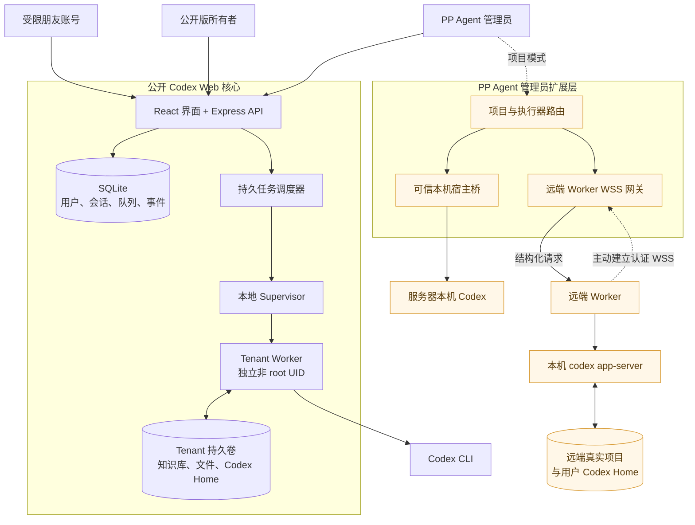
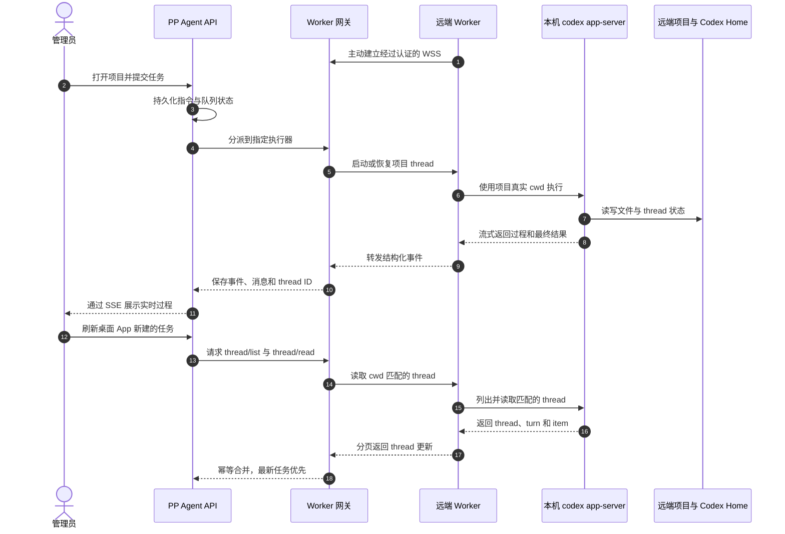
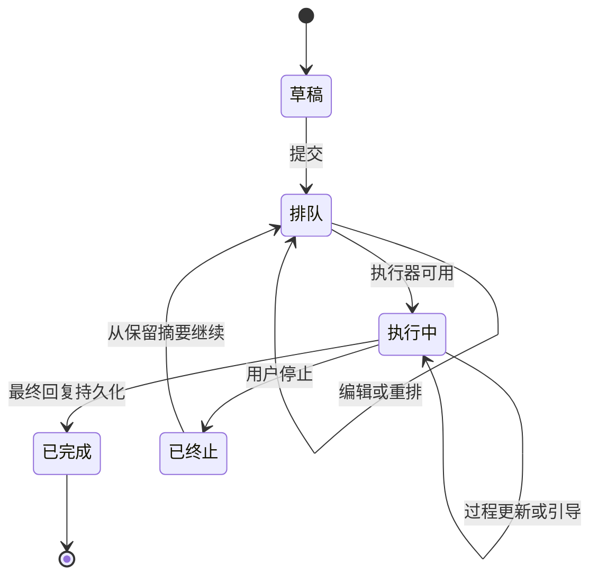

# Codex Web

Codex Web 是一个非官方、自托管的 OpenAI Codex CLI 网页工作台。它提供持久化会话、未发送草稿、附件与交付文件、服务器端任务排队、实时引导、可续接的终止记录、完整工作记录、完成任务未读提示、引用提问、自动命名、字号调节以及可选的语音转写。

> 本项目由社区独立开发，与 OpenAI 没有关联，也未获得 OpenAI 的背书或支持。

## 快速开始

环境要求：Docker Engine、Docker Compose v2，以及可登录 Codex CLI 的账号。

```bash
cp .env.example .env
npm ci
npm run hash-password -- '请设置一个至少十二位的独立密码'
```

把生成的哈希填入 `.env` 的 `APP_PASSWORD_HASH`，并设置至少 32 个字符的随机 `SESSION_SECRET`。然后执行：

```bash
docker compose up -d --build
docker compose exec --user 11001:11001 \
  -e HOME=/app/tenants/00000000-0000-4000-8000-000000000001 \
  -e CODEX_HOME=/app/tenants/00000000-0000-4000-8000-000000000001/codex-home \
  app codex login --device-auth
```

打开 [http://localhost:37821/codex-web/](http://localhost:37821/codex-web/) 即可使用。队列、附件、会话、Codex 线程，以及输入框中尚未发送的正文、引用和附件都保存在服务器端；切换会话、关闭浏览器或换设备后仍可继续编辑。

运行中的工作记录不再形成独立的纵向滚动区，而是按照现有记录上限随页面自然展开。用户终止任务后，关键执行过程会保留为一条历史消息，下一轮可从终止处继续。本地 Excel 附件由托管的 openpyxl/pandas 技能处理，详细 Excel 规则只在本轮确实包含对应附件时注入。Apps、连接器、Goals 和多代理能力默认关闭，仅在用户明确提出时启用。

## 这套工程解决什么问题

Codex Web 是个人 Agent 工作站中可复用、可公开部署的核心。它把一次性的 Codex CLI 交互变成持久服务：即使关闭浏览器，会话、草稿、待发送任务、附件、过程事件、Codex thread ID 和最终文件仍保存在服务器上，换设备后也能继续。

完整的 PP Agent 部署会在这个核心之上增加管理员执行层：朋友或普通成员继续在彼此隔离的 Docker tenant 中运行；管理员则可以按项目明确选择服务器本机执行器，或选择另一台电脑上主动连入的 Remote Worker。为了让公开版本保持安全默认值，本仓库只直接发布低权限核心；管理员宿主桥、项目模式、远端 Worker 网关和生产账号配置属于扩展组件，并不是克隆本仓库后自动启用的功能。

### 账号角色与执行边界

| 角色 | 任务在哪里执行 | 可以访问什么 | 适用场景 |
| --- | --- | --- | --- |
| 受限朋友账号 | Docker 内的非 root tenant worker | 仅自己的会话、知识库、附件、输出和 Codex Home | 允许朋友使用 Agent，但不能接触宿主机或其他用户数据 |
| 公开版所有者 | 同样使用隔离 tenant | 自己的工作区与服务配置 | 本仓库默认的单所有者自托管方式 |
| PP Agent 管理员 | 明确选择的本机或远端项目执行器 | 管理员主动添加的项目及其历史任务 | 管理可信服务器项目，以及已连接电脑上的 Codex |



这里最重要的安全边界是“执行器”，而不只是浏览器账号。受限账号不能把普通 Web 请求变成宿主机访问：任务先经过路径和用户校验，再交给固定 Unix 身份，只能触达自己的 tenant。管理员项目模式则代表一次额外、明确的信任选择，所以它不会混进公开版的默认部署。

### 管理远端电脑上的 Codex

Remote Worker 不开放入站 Shell、远程桌面或通用隧道。它主动向服务器建立应用层 WSS 连接，只处理已注册项目的结构化请求。Codex 仍以那台电脑的交互用户运行，`cwd` 是真实项目目录，Codex Home 也是该用户原有目录，因此网页发起的 thread 与桌面 App 发起的 thread 可以共享同一套本机 Codex 历史。



远端同步是显式操作，而不是伪装成分布式文件系统。服务端通过 thread、turn 和 item ID 幂等合并；电脑离线时历史仍然保留，新任务等待执行器恢复。项目归档只做隐藏，不删除任务；归档期间停止显式同步，以后重新添加同一执行器上的同一文件夹即可恢复原历史，并可使用新名称。

### 持久任务生命周期

浏览器只是控制界面，不持有任务真相。草稿和附件在发送前就可以保存；排队任务可以编辑、重排、删除，也可以转为对当前任务的实时引导。不同会话可以并行，同一会话保持串行。过程事件会压缩为有上限的工作记录，同时保留重要阶段反馈；工作记录随主页面展开，最终回复保存后过程卡片自动消失。



工程把持久状态分成四类：

- SQLite 应用状态：用户、Session、会话、消息、草稿、任务、事件、排序和 thread 引用；
- Tenant 知识与文件：每个用户自己的长期知识、上传、输出和不可变交付文件；
- Codex 状态：保存在对应执行器 Codex Home 中的登录信息与 thread 历史；
- 运行时状态：每个任务独立的临时目录和进程，服务重启后可以从持久状态恢复。

公开版 Web 进程没有 Docker socket、宿主文件系统挂载或 root bridge。准备根据扩展架构搭建自己的管理员与远端执行能力前，请先阅读[架构说明](docs/ARCHITECTURE.md)和[安全说明](docs/SECURITY.md)。

## 可选语音输入

在 `.env` 中设置你自己的 `DASHSCOPE_API_KEY` 和 HTTPS `PUBLIC_BASE_URL` 后，页面会显示麦克风按钮。默认使用 `qwen3.5-omni-plus`，可通过 `DASHSCOPE_ASR_MODEL` 修改。未设置 Key 时语音功能完全关闭。

公网部署请配置 HTTPS；浏览器通常只允许在 HTTPS 或 localhost 页面调用麦克风。

更多信息请参阅 [部署说明](docs/DEPLOYMENT.md)、[架构说明](docs/ARCHITECTURE.md) 与 [安全说明](docs/SECURITY.md)。
