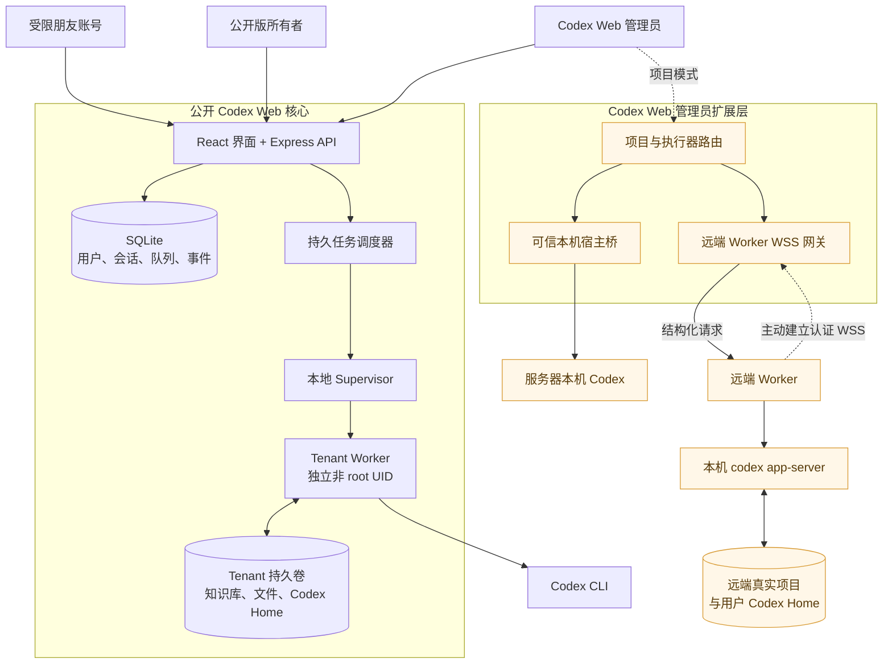
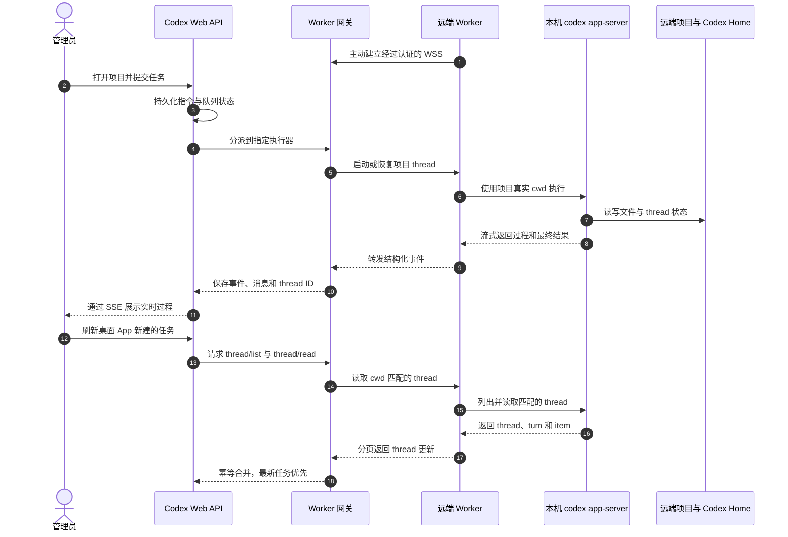
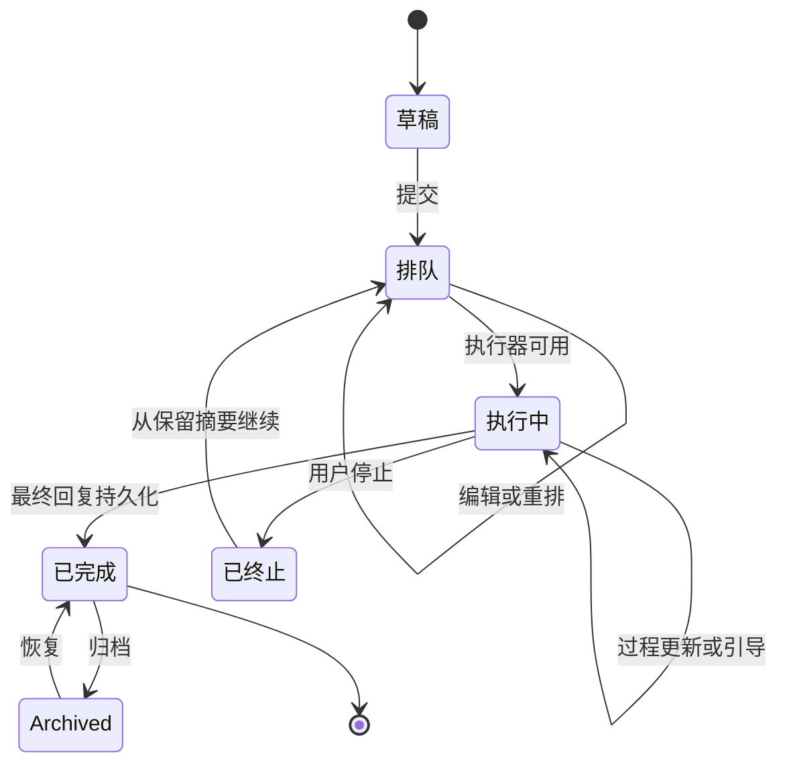

# Codex Web

Codex Web 是一个非官方、自托管的 OpenAI Codex CLI 网页工作台。它提供持久化会话、未发送草稿、附件与交付文件、服务器端任务排队、实时引导、一次性定时或外部事件续跑、可续接的终止/中断记录、会话归档、完整工作记录、完成任务未读提示、引用提问、独立 Codex 命名、字号调节以及可选的语音转写。

> 本项目由社区独立开发，与 OpenAI 没有关联，也未获得 OpenAI 的背书或支持。

阅读器支持从当前 Markdown 文档选中文本后直接询问 Reader Agent，引用会以可移除的引用卡片进入同一会话；公开版仍只使用账号密码登录，服务端模型与语音能力由部署者自行配置。

## 快速开始

面向新云服务器的完整部署、登录、备份、更新与验收步骤，请参阅 [AI 云服务器部署与运维手册](AI_CLOUD_DEPLOYMENT_RUNBOOK.md)。公开版网页登录始终使用 `.env` 中的 `APP_USERNAME` 与 `APP_PASSWORD_HASH`；本仓库不提供手机号或短信登录。

环境要求：Docker Engine、Docker Compose v2，以及可登录 Codex CLI 的账号。

```bash
cp .env.example .env
npm ci
npm run hash-password -- '请设置一个至少十二位的独立密码'
```

把生成的哈希填入 `.env` 的 `APP_PASSWORD_HASH`，并设置至少 32 个字符的随机 `SESSION_SECRET`。然后执行：

```bash
docker compose up -d
docker compose exec --user 11001:11001 \
  -e HOME=/app/tenants/00000000-0000-4000-8000-000000000001 \
  -e CODEX_HOME=/app/tenants/00000000-0000-4000-8000-000000000001/codex-home \
  app codex login --device-auth
```

打开 [http://localhost:37821/codex-web/](http://localhost:37821/codex-web/) 即可使用。队列、附件、会话、归档记录、Codex 线程，以及输入框中尚未发送的正文、引用和附件都保存在服务器端；切换会话、关闭浏览器或换设备后仍可继续编辑。

需要可审计的源码自发布时，可用 `deploy/codex-web-request-rebuild` 把干净提交放入队列，再由 `deploy/codex-web-rebuild-coordinator` 串行构建、验证、启动和健康检查；`codex-web-self-maintain.service/.path` 是可选的 systemd 模板。队列、状态和回滚证据写入操作者自行指定的状态目录，不进入仓库。

运行中的工作记录先加载完整快照，再接入实时事件，不再要求刷新页面才能看到完整过程；记录按现有上限随页面自然展开。协作 Agent 会显示各自运行/完成/异常状态，子 Agent 通知不会误改父任务终态。排队与运行状态使用不同图标；任务操作收进稳定的菜单。会话处于定时或事件等待时，普通待发送任务继续排队，用户可以明确选择“插入”，运行中则使用“引导”。用户终止任务后，关键执行过程会保留为历史消息；服务意外重启也会明确标记未完成任务，避免把中断误认为完成或自动重复执行。

手动安排自动续跑时可以选择继续当前会话或立即创建新会话，并单独选择续跑模型与思考深度；Codex 自行登记时默认继承当前 Job，只有用户明确要求才覆盖。模型容量不足且本轮尚未产生真实命令、文件或阶段进展时，任务会按 10 秒、30 秒、1/2/3/4/5 分钟重试；如果已经产生进展，后续会在原会话中使用“继续未完成任务”的提示续接，不重复原始指令或附件。错误、等待和开始重试都会进入实时工作记录。

已完成的会话可以无损归档和恢复；当 Codex rollout 达到 500 MiB 时，界面会提示新建任务以控制超长上下文成本。会话容量菜单同时显示 rollout 大小、最近输入上下文/模型窗口和当前 Codex 套餐剩余额度。大文件支持取消和断点续传，本地生成图片会自动登记为成品并使用服务端缩略图展示。Markdown 文件可以打开原文或进入登录态保护的阅读模式，其中 LaTeX 公式按需渲染；HTML 在无脚本、无同源权限的沙箱中预览。报告等长篇材料默认交付单一自包含、响应式 HTML；已完成的 Markdown/HTML 成品可由用户主动开启固定公开链接，并随时关闭。文本下载响应明确声明 UTF-8，保持 iOS Safari 中文预览稳定。

移动 Safari 使用固定应用外壳，只让内容区滚动；阅读器在选区/放大镜触发视口滚动时不强制把根页面滚回顶部，避免丢失浏览器选区；阅读器头部的导航、标题和操作按钮保持稳定分栏。待发送任务支持触屏拖动，登录恢复请求卡住时会有界超时重试，恢复完成前持续显示“正在恢复上次任务…”，不会先闪出欢迎页。点击“新建任务”会复用并临时顶前一个真正空白的任务；其他任务产生新活动后仍会自然排到前面。打开未读会话会定位到对应回复之前的用户提问，异步公式资源失败时也会自动重试。首条需求的短标题由隔离的 Codex Luna 低思考 Worker 独立生成，主任务回复不再承担命名，命名请求、模型、耗时、结果与应用状态记录在 SQLite 审计表中。本地 Excel 附件由托管的 openpyxl/pandas 技能处理，详细 Excel 规则只在本轮确实包含对应附件时注入。报告、调研、分析和其他长篇材料由托管的 `html-report` 技能默认生成单一自包含 HTML；技能目录、样式指南、模板和校验脚本会随每个新租户自动初始化。Apps、连接器、Goals 和多代理能力默认关闭，仅在用户明确提出时启用。

助手回复提供紧凑复制按钮；空白移动端输入框长按 650 毫秒可开始录音，达到五分钟上限时会先给出明确提示再转写。定时指令使用独立的时钟身份，不再显示成普通用户消息；相对延后从计划当前截止时间继续累加。账户设置支持点击外部或按 Escape 关闭，默认 Web 会话有效期为 14 天。

## 这套工程解决什么问题

Codex Web 是个人 Agent 工作站中可复用、可公开部署的核心。它把一次性的 Codex CLI 交互变成持久服务：即使关闭浏览器，会话、草稿、待发送任务、附件、过程事件、Codex thread ID 和最终文件仍保存在服务器上，换设备后也能继续。

完整的 Codex Web 部署会在这个核心之上增加管理员执行层：朋友或普通成员继续在彼此隔离的 Docker tenant 中运行；管理员则可以按项目明确选择服务器本机执行器，或选择另一台电脑上主动连入的 Remote Worker。项目模式、项目侧栏、跨项目移动、宿主 root bridge、Remote Worker、账号管理、共享认证、个人记忆/上下文和冷存储的实现都随仓库提供，但默认没有令牌、端点、socket、云盘 CLI 或真实数据，因此克隆后不会自动启用。

### 账号角色与执行边界

| 角色 | 任务在哪里执行 | 可以访问什么 | 适用场景 |
| --- | --- | --- | --- |
| 受限朋友账号 | Docker 内的非 root tenant worker | 仅自己的会话、知识库、附件、输出和 Codex Home | 允许朋友使用 Agent，但不能接触宿主机或其他用户数据 |
| 公开版所有者 | 同样使用隔离 tenant | 自己的工作区与服务配置 | 本仓库默认的单所有者自托管方式 |
| Codex Web 管理员 | 明确选择的本机或远端项目执行器 | 管理员主动添加的项目及其历史任务 | 管理可信服务器项目，以及已连接电脑上的 Codex |


```mermaid
flowchart TB
    member["受限朋友账号"] --> web
    owner["公开版所有者"] --> web
    admin["Codex Web 管理员"] --> web

    subgraph core["公开 Codex Web 核心"]
        web["React 界面 + Express API"]
        db[("SQLite<br/>用户、会话、队列、事件")]
        queue["持久任务调度器"]
        supervisor["本地 Supervisor"]
        tenant["Tenant Worker<br/>独立非 root UID"]
        tenantState[("Tenant 持久卷<br/>知识库、文件、Codex Home")]

        web --> db
        web --> queue --> supervisor --> tenant
        tenant <--> tenantState
    end

    tenant --> tenantCodex["Codex CLI"]

    subgraph extension["Codex Web 管理员扩展层"]
        router["项目与执行器路由"]
        hostBridge["可信本机宿主桥"]
        gateway["远端 Worker WSS 网关"]
    end

    admin -. "项目模式" .-> router
    router --> hostBridge --> hostCodex["服务器本机 Codex"]
    router --> gateway
    remoteWorker["远端 Worker"] -. "主动建立认证 WSS" .-> gateway
    gateway -->|"结构化请求"| remoteWorker
    remoteWorker --> appServer["本机 codex app-server"]
    appServer <--> remoteState[("远端真实项目<br/>与用户 Codex Home")]

    classDef extensionNode fill:#fff7e8,stroke:#d89b35,color:#583b0a;
    class router,hostBridge,gateway,hostCodex,remoteWorker,appServer,remoteState extensionNode;
```

这里最重要的安全边界是“执行器”，而不只是浏览器账号。受限账号不能把普通 Web 请求变成宿主机访问：任务先经过路径和用户校验，再交给固定 Unix 身份，只能触达自己的 tenant。管理员项目模式代表一次额外、明确的信任选择；只有配置 host bridge socket、Remote Worker 配对凭据等条件后才会启用。

### 管理远端电脑上的 Codex

Remote Worker 不开放入站 Shell、远程桌面或通用隧道。它主动向服务器建立应用层 WSS 连接，只处理已注册项目的结构化请求。Codex 仍以那台电脑的交互用户运行，`cwd` 是真实项目目录，Codex Home 也是该用户原有目录，因此网页发起的 thread 与桌面 App 发起的 thread 可以共享同一套本机 Codex 历史。


```mermaid
sequenceDiagram
    autonumber
    actor A as 管理员
    participant API as Codex Web API
    participant G as Worker 网关
    participant W as 远端 Worker
    participant C as 本机 codex app-server
    participant P as 远端项目与 Codex Home

    W->>G: 主动建立经过认证的 WSS
    A->>API: 打开项目并提交任务
    API->>API: 持久化指令与队列状态
    API->>G: 分派到指定执行器
    G->>W: 启动或恢复项目 thread
    W->>C: 使用项目真实 cwd 执行
    C->>P: 读写文件与 thread 状态
    C-->>W: 流式返回过程和最终结果
    W-->>G: 转发结构化事件
    G-->>API: 保存事件、消息和 thread ID
    API-->>A: 通过 SSE 展示实时过程
    A->>API: 刷新桌面 App 新建的任务
    API->>G: 请求 thread/list 与 thread/read
    G->>W: 读取 cwd 匹配的 thread
    W->>C: 列出并读取匹配的 thread
    C-->>W: 返回 thread、turn 和 item
    W-->>G: 分页返回 thread 更新
    G-->>API: 幂等合并，最新任务优先
```

远端同步是显式操作，而不是伪装成分布式文件系统。服务端通过 thread、turn 和 item ID 幂等合并；电脑离线时历史仍然保留，新任务等待执行器恢复。项目归档只做隐藏，不删除任务；归档期间停止显式同步，以后重新添加同一执行器上的同一文件夹即可恢复原历史，并可使用新名称。

### 持久任务生命周期

浏览器只是控制界面，不持有任务真相。草稿和附件在发送前就可以保存；排队任务可以编辑、重排、删除，也可以转为对当前任务的实时引导。不同会话可以并行，同一会话保持串行。过程事件会压缩为有上限的工作记录，同时保留重要阶段反馈；工作记录随主页面展开，最终回复保存后过程卡片自动消失。


```mermaid
stateDiagram-v2
    state "草稿" as Draft
    state "排队" as Queued
    state "执行中" as Running
    state "已完成" as Completed
    state "已终止" as Cancelled
    [*] --> Draft
    Draft --> Queued: 提交
    Queued --> Queued: 编辑或重排
    Queued --> Running: 执行器可用
    Running --> Running: 过程更新或引导
    Running --> Completed: 最终回复持久化
    Running --> Cancelled: 用户停止
    Cancelled --> Queued: 从保留摘要继续
    Completed --> Archived: 归档
    Archived --> Completed: 恢复
    Completed --> [*]
```

工程把持久状态分成四类：

- SQLite 应用状态：用户、Session、会话、消息、草稿、任务、事件、排序和 thread 引用；
- Tenant 知识与文件：每个用户自己的长期知识、上传、输出和不可变交付文件；
- Codex 状态：保存在对应执行器 Codex Home 中的登录信息与 thread 历史；
- 运行时状态：每个任务独立的临时目录和进程，服务重启后可以从持久状态恢复。

长流程可以显式登记一次性续跑计划。调度时间和外部事件回执会持久化，但不会用 `sleep` 长时间占住 Agent 回合；详见 [持久续跑](docs/WAKE_AUTOMATION.md)。

默认 Compose 不挂载 Docker socket、宿主文件系统或 root bridge，也不包含共享认证登录态。若要启用这些可选能力，请先阅读[架构说明](docs/ARCHITECTURE.md)和[安全说明](docs/SECURITY.md)，逐项配置并审计权限。

## 可选语音输入

在 `.env` 中设置你自己的 `DASHSCOPE_API_KEY` 和 HTTPS `PUBLIC_BASE_URL` 后，页面会显示麦克风按钮。默认使用 `qwen3.5-omni-plus`，可通过 `DASHSCOPE_ASR_MODEL` 修改。未设置 Key 时语音功能完全关闭。

录音上传前，浏览器会按账号和会话把完整音频保存到 IndexedDB，保留 24 小时。若电梯等场景导致网络在发送中断，输入框会保留“语音未发送，音频已保留”的状态，可重试识别或删除，不会丢失原始音频。重试沿用同一个客户端录音 UUID；服务端记录音频大小和哈希，若第一次请求其实已经完成，会直接返回原转写结果而不会重复调用模型。浏览器草稿和服务端回执都会在 24 小时后清理。

语音模型使用的额外拼写/话题上下文默认限制为约 500 token，由草稿、附件名、文本附件开头 16 KiB、最近对话、固定技术词和最多两张小图片共同分配；未发送的大文件不会整份进入转写请求。可通过 `TRANSCRIPTION_CONTEXT_TOKEN_BUDGET`、`TRANSCRIPTION_CONTEXT_MAX_IMAGES` 和 `TRANSCRIPTION_CONTEXT_MAX_IMAGE_BYTES` 调整。

公网部署请配置 HTTPS；浏览器通常只允许在 HTTPS 或 localhost 页面调用麦克风。

更多信息请参阅 [部署说明](docs/DEPLOYMENT.md)、[架构说明](docs/ARCHITECTURE.md) 与 [安全说明](docs/SECURITY.md)。
